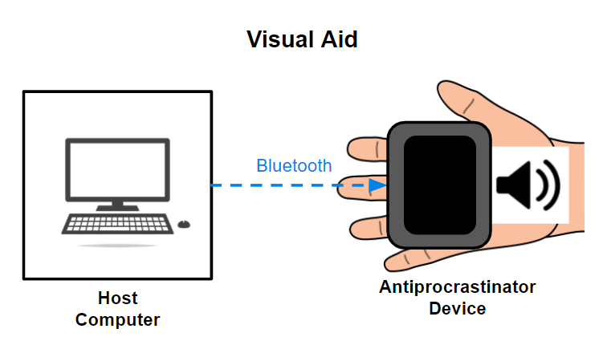
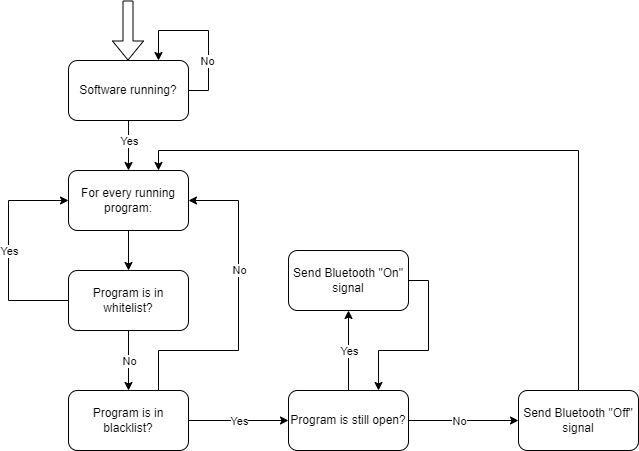

# __Team Antiprocrastinator Design Document__
Group 19 - Brandon Wong, Kyle Chiu, and Taylor Plummer  
TA - Zhicong Fan
## __Introduction__
#### __Problem__
Procrastination has been a huge hurdle in the lives of many students and workers. While some people have the self-discipline to get work done, many people like our group aren't great at staying focused. Some of our members have participated in procrastination and have also had firsthand experience of the consequences of procrastination (e.g. all-nighters, lower grades). Many procrastinators like ourselves push school and work to the side and instead pursue various forms of entertainment, such as computer games or internet videos, in order to avoid doing work. This forces procrastinators to put off their assignments until the deadline, to which they are forced to cram a few days' worth of work into a few hours, which consequently means that the procrastinator will be physically and mentally exhausted, and the work completed will be of mediocre quality at best.
#### __Solution__
The solution is to make procrastinating harder. Specifically, we will be hindering the access of any websites or computer programs that the user has blacklisted. There are browser extensions that can block websites, but those just leave the user waiting in anticipation until their websites are unblocked when the timer ends. Our goal is to use a wireless, battery-powered watch with an integrated speaker that, upon receiving a signal from the computer that the user is using blacklisted sites/programs, continuously plays an annoying sound until said sites/programs are closed. This watch consists of a few components in order for it to work:
- Computer software that detects what programs are being run and what websites are currently open
- A Bluetooth module that will receive signals from the user's computer
- A sound-emitting device (i.e. a piezo buzzer)
- A small microcontroller that handles the signals from the Bluetooth module
- Power circuit for handling the different voltages and charging
#### __Visual Aid__

#### __High-Level Requirements__
- The watch must be able to wirelessly connect to the computer via Bluetooth.
- The watch's output must be noticeable/annoying to the user for the watch to be effective at deterring procrastination (between 40-60 dB).
- The delay between opening/closing a blacklisted website and the watch buzzer turning on/off should be small (less than 6 seconds).
## __Design__
#### __Block Diagram__

#### __Circuit Schematic__

#### __Windows Software Flowchart__

#### __Browser Extension Software Flowchart__

#### __Subsystem Overview__
##### Power Subsystem
The Power Subsystem provides all of the power for all of the components in our device. Using the 3.7v battery and the 3v voltage regulator, the Power Subsystem is able to provide all of the necessary voltages that the various components in our device use. The Power Subsystem connects to the Control and Output Subsystems by providing 3.7v to the board microcontroller. It also connects to the Control Subsystem by providing 3v to the Bluetooth module. Lastly, it provides 3.7v to the piezo buzzer in the Output Subsystem.
##### Control Subsystem
The Control Subsystem receives any Bluetooth data coming from the host computer so it knows what to tell the microcontroller (e.g. to turn the piezo buzzer on/off). The Bluetooth module in the Control Subsystem gets the Bluetooth data, and then relays it to the board microcontroller. The Control Subsystem connects to the Output Subsystem by the board microcontroller generating a 1000 Hz square wave, which is sent to the piezo buzzer in the Output Subsystem. In order to preserve power, the device will be programmed to check for blacklisted websites/programs every 5 seconds and send the square wave if it detects a blacklisted item. It will send this wave while the website/program stays open until 3 minutes have passed, where it will stop and wait for another 3 minutes before sending the signal again for another 3 minutes if the website/program continues to stay open.
##### Output Subsystem
The Output Subsystem receives waves from the board microcontroller and plays it out loud via the piezo buzzer in the Output Subsystem. The Output Subsystem's main function is to annoy the user (via the loud piezo buzzer) whenever a blacklisted website/program is opened, and it keeps playing until the blacklisted websites/programs are closed. The effectiveness of our project depends on the Output Subsystem.
##### User Interface Subsystem
The User Interface Subsystem reads programs and websites running on the user's host computer. The user can whitelist/blacklist websites/programs via Windows software and browser extension software. The detection of blacklisted websites/programs and the user interface to add websites/programs to the blacklist/whitelist is provided by the software in the User Interface Subsystem. When the software detects a blacklisted website/program running, it sends a wireless signal via Bluetooth to our device's Bluetooth module, which is how the User Interface Subsystem connects with the Control Subsystem.
#### __Subsystem Requirements__
##### Power Subsystem
| Requirements | Verification |
|:------|:------------|
| The Power Subsystem must be able to supply at least 50mA of current on start up to handle bluetooth connection | 1A. connect battery to regulator and bluetooth module. 2A. Use an oscilloscope to determine current and voltage between bluetooth and regulator.|
| The Power Subsystem must be able to supply at least 20mA of current to handle peak microcontroller and buzzer power | 1A. connect battery to microcontroller and buzzer. 2A. Use an oscilloscope to determine current and voltage between battery and microcontroller as well as between buzzer and microcontroller.|
| The Power Subsystem must be able to supply power to the device for at least 7 hours on a full charge | 1A. Charge the device battery fully using USB-C. 1B. Connect device to host computer and use normally, visiting at least one blacklisted site an hour. 1C. Determine what time the battery stops being sufficient to power the system by monitoring when the device doesnt continue working. |

##### Control Subsystem
| Requirements | Verification |
|:------|:------------|
| The Control Subsystem must be able to receive a bluetooth signal sent from a host computer to the bluetooth module| Connect bluetooth module to correct power and connect with computer. Send training data through bluetooth and verify at bluetooth module data pin that data was recieved using a microcontroller program to display output.|
| Microcontroller must be able to interpret the signal received by the Bluetooth module to turn on/off output | Connect bluetooth module to correct power and connect with computer. Write microcontroller code that uses data sent by the host computer through bluetooth to turn on and off an LED.|

##### Output Subsystem

| Requirements | Verification |
|:--------|:------------|
| Microcontroller must be able to create a 1000 Hz square wave for the buzzer | Load code to produce the wave on the microcontroller and run it while using an oscilloscope to verify that the wave is of the correct form and within +- 50Hz.|
| The piezo buzzer must be able to output a noise of about 40dB-60dB whenever the board microcontroller sends a 1000 Hz square wave to the piezo buzzer | Once the Microcontrollers wave has been verified, wire that wave into the input of the buzzer and measure the sound using a decibel sensor.|

##### User Interface Subsystem
| Requirements | Verification |
|:--------|:------------|
| The User Interface Subsystem must be able to allow a user to add/remove applications/websites to a blacklist/whitelist managed by the browser extension software and Windows software | 1A. Use the Interface to add and remove websites from the blacklist/whitelist. 1B. Visit those sites and check if device is performing the appropriate action.|
| The User Interface must be able to detect what applications and websites are running/open | 1A. Give a list of applications and websites to the program to check. 1B. Make sure that some are open and the pthers are closed. 1C Read the programs output and veify that it is correct about which programs are open and closed.|
| The User Interface must be able to send a 'start'/'stop' signal via Bluetooth to the Bluetooth module | 1A. Code microcontroller to be able to interpret data from bluetooth module. 1B. Send signals from host computer to device over bluetooth and verify that the microcrontoller can discern between the two signals 'start' and 'stop' (which can be any arbitrary signal such as 0 or 1). |

#### __Tolerance Analysis__
The battery power is one area of tolerance that is important for our design because if the battery life is not sufficent, users will not be satisfied. On the other hand if the battery we use is too large then it will cause the device to be heavier than neccessary which hinders the user. To get the total lifetime of the battery under the designs current parts we need to determine Itotal which is the total current draw on the battery as well as its voltage Vcc and C the total mWh of the battery. Then we can use the equation, Battery Life = (Itotal * Vcc)/C. We also use a linear voltage regulator between the battery and the bluetooth module which has an input voltage of 3.7V and an output of 3.3V. This ratio 3.3 / 3.7 gives us the efficiency of the regulator and will determine the power supplied by the battery of the bluetooth module. 

As retrieved from data sheets and research, the bluetooth module will draw about 30mA of current in the worst case scenario and since it is behind the regulator its effective power drawn from the battery would be (3.3 * 30) * (3.3 / 3.7) = 88.3 mW. The microcontroller and buzzer will draw 8mA and as much as 10mA respectively, so their effective powers will be (8 * 3.3) = 26.4mW and (10 * 3.3) = 33mW. The total power drawn from the battery by these components will be 147.7mW and given that the battery is rated at 1295mWh at full charge, our device should be able to run for 1295mWh / 147.7mW = ~8.75 hours. This is a good amount of time that will allow the user to use it for just about as long as work day without having to charge.
## Cost and Schedule
### Cost Analysis
#### Labor
We are basing our analysis on the formula: ($/hour) x 2.5 x (hours to complete). Using a conservative estimate of $25 per hour and about 80 hours to complete, each team member would cost $5,000. And since we have a total of 3 team members, the total cost for labor is $15,000.
#### Parts
| Part Name | Part Description | Manufacturer | Part # | Quantity | Cost |
|:----------|:-----------------|:------------:|-------:|---------:|-----:|
| Micro-Lipo Charger | Small PCB board that handles battery charging via USB Type-C. | Adafruit Industries | 4410 | 1 | $5.95 |
| 3.3v Voltage Regulator | Voltage regulator that produces an output of 3.3v. | STMicroelectronics | LD1117V33 | 1 | $2.10 |
| Lithium Ion Polymer Battery (1200mAh) | A lithium-ion polymer battery with a capacity of 1200 mAh and an output voltage of 3.7v. | Adafruit Industries | 258 | 1 | $9.95 |
| ATtiny85 Microcontroller | An 8-pin 8-bit programmable microcontroller processor. | Atmel | COM-09378 | 1 | $3.50 |
| DIP 8-Pin Socket | An 8-pin DIP socket that can fit an ATtiny85 microcontroller. | Sparkfun Electronics | PRT-07937 | 1 | $0.55 |
| Piezo Buzzer | A small piezo buzzer that can make loud buzzing noises. | Adafruit Industries | 1740 | 1 | $0.95 |
| HC-05 Wireless Bluetooth Transceiver | A wireless Bluetooth transceiver that can both send and receive Bluetooth signals. | Olimex | BLUETOOTH-SERIAL-HC-05 | 1 | $8.59 |
| Female-To-Female Jumper Wires (x20) | Jumper wires for electrical connections. | Adafruit Industries | 1951 | 1 | $1.95 |
| SPDT Slide Switch | Slide switch to power on/off the device | Adafruit Industries | 805 | 1 | $0.95 |
| Tiny AVR Programmer | A PCB with a USB port and an onboard 8-pin socket for ATtiny 8-pin microcontrollers so that they can be more easily programmed. | Sparkfun Electronics | PGM-11801 | 1 | $17.50 |
#### Grand Total
Grand Total = $15,051.99
### Schedule
#### Week 2/21
- Finish design document
- Complete rough draft of PCB design and parts layout
- Start high-level software design
#### Week 2/28
- Start and finish rough draft of PCB design in CAD
- Order all parts
- Start creating software for Windows and Chrome extension
#### Week 3/7
- Finalize PCB CAD design and order PCB
- Continue working on software functionality for Windows and Chrome extension software
- Start breadboard prototyping the device
#### Week 3/14
- Continue working on software functionality for Windows and Chrome extension software
- Test basic functionality of all parts
- Solder parts to PCB
#### Week 3/21
- Finish software functionality for Windows and Chrome extension software
- Test Bluetooth functionality and pairing with host device
#### Week 3/28
- Start designing and creating software GUI
- Test Bluetooth signal reception from device and microcontroller response
#### Week 4/4
- Finish software GUI
- Begin testing device functionality
#### Week 4/11
- Finish testing device functionality
- Finalize software and the device
## __Ethics and Safety__
In the interest of following principle 1.2 of the ACM Code of Ethics, we will ensure that the possibility of being injured or harmed by our project is minimal by selecting a piezo buzzer with a low decibel range that match our requirements of being 40-60 dB as to not harm the ears of our users [3]. We hope to respect privacy and honor confidentiality of our users as stated in principles 1.6 and 1.7 by having users input the desired websites and programs to blacklist rather than automatically collecting data on the users browsing habits and having the device decide [1]. We will act in accordance with principle 2.9 by thoroughly testing and updating the functions of our device to make sure it works as intended, focusing on specifically making sure that the device is able to detect user-inputted websites and programs, and emitting a safe level of noise when doing so. In the same vein, we will ensure that this data remains secure so that there are no potential leaks of information of any kind.
In order to follow the guidelines of the IEEE Code of Ethics, we will keep the safety, health, and welfare of the public as a top priority when designing our project [2]. Our project involves a lot of potentially dangerous electrical components. Should any of these components prove to endanger a user in any way, we will make revisions to our design in order to remove the threat.
However, since we are dealing with very low voltages (3.7v), our project is not as dangerous as other projects dealing with higher voltages.
But since we are dealing with lithium-ion batteries, we will link a University lab safety document to mitigate any possible issues with batteries[4].
### __References__
[1] “ACM Code of Ethics Booklet - Association for Computing ...” [Online]. Available: https://www.acm.org/binaries/content/assets/about/acm-code-of-ethics-booklet.pdf. [Accessed: 22-Feb-2022]. 

[2] “IEEE code of Ethics,” IEEE. [Online]. Available: https://www.ieee.org/about/corporate/governance/p7-8.html. [Accessed: 22-Feb-2022]. 

[3] “What noises cause hearing loss?,” Centers for Disease Control and Prevention, 07-Oct-2019. [Online]. Available: https://www.cdc.gov/nceh/hearing_loss/what_noises_cause_hearing_loss.html#:~:text=Common%20Sources%20of%20Noise%20and%20Decibel%20Levels&amp;text=A%20whisper%20is%20about%2030,immediate%20harm%20to%20your%20ears. [Accessed: 22-Feb-2022]. 

[4] “Battery Safety.” Illinois [Online]. Available: https://drs.illinois.edu/Page/SafetyLibrary/BatterySafety. [Accessed: 22-Feb-2022].
