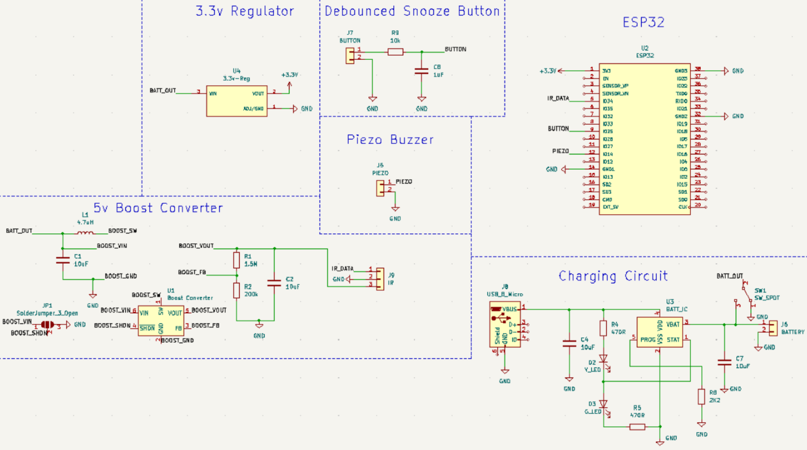
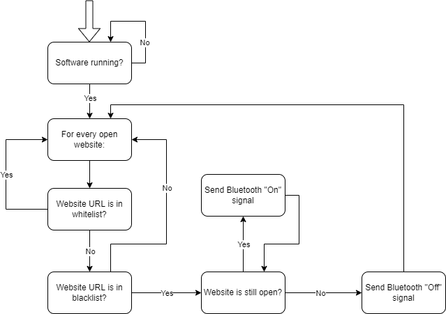
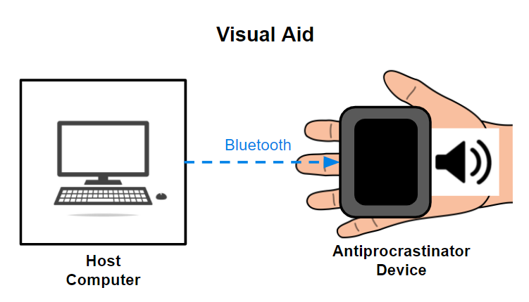

# Notebook for Kyle Chiu
## __Entry 1: 02/09/2022:__ Project Proposal
- As a team, we worked on and eventually finished the Project Proposal.
## __Entry 2: 02/12/2022:__ Component Selection
- I decided on all of the parts that we needed for our project. For our Power Subsystem, I decided on using a small charging circuit board and a LiPo battery and an SPDT slide switch from Adafruit, and a 3.3v Voltage Regulator. For our Control Subsystem, I decided on an ATtiny85 microcontroller, an 8-pin DIP socket, an HC-05 wireless BlueTooth transceiver, and a Tiny AVR programmer. For our Output Subsystem, I decided on a piezo buzzer and some jumper wires from Adafruit.
## __Entry 3: 02/15/2022:__ Circuit Schematic
- I created a rough draft of the PCB component layout, basically where every single part should be placed on the PCB.
- I also created a circuit schematic for the Design Document.

## __Entry 4: 02/17/2022:__ Design Check Sections
- I created flowcharts for our Windows and browser extension software for how they're supposed to operate/loop during execution.

- I also finished cost analysis and the schedule sections, and updated ethics/safety section for the Design Document.
## __Entry 5: 03/01/2022:__ Design Document Revisions
- I revised block diagram to supply microcontroller with 3.3 volts instead of originally planned 3.7 volts. 
- I also updated block diagram to reflect piezo buzzer signal coming from microcontroller and not from 3.7 volt source. 
## __Entry 6: 03/03/2022:__ More Design Document Revisions
- I adjusted visual aid to have hand for scale to show size of device relative to the hand.

- In general, I updated the Design Document based on the Design Document review feedback. I started thinking about ways to increase hardware complexity. One way is to replace the charging circuit PCB from Adafruit with an actual circuit that we would build instead of a prebuilt PCB.
## __Entry 7: 03/06/2022:__ Redesign Circuit Schematic
- I redesigned the circuit schematic to reflect changes in overall device design. Trying to solder an SMD BlueTooth module is not the way to go, so we decided to replace our microcontroller and the BlueTooth module with an ESP32.
- I also redesigned the circuit schematic to have support for our IR sensor functionality that we're trying to add as well as a snooze button.
- I added 2 circuits to the schematic, one that handles LiPo charging and another boost converter circuit that boosts the battery voltage to 5 volts which is needed for the IR sensor.
## __Entry 8: 03/08/2022:__ Repick Parts and Finish Circuit Schematic
- I finished researching all parts needed to complete the updated circuit schematic, mostly the ESP32 and the ICs, resistors, capacitors, and other components needed to complete the boost converter and charging circuits.
- I also completely finished the circuit schematic in KiCad for the updated circuit schematic. 
## __Entry 9: 03/15/2022:__ Redesign Boost Converter Circuit
- I took a count of all of the parts that we needed to ensure that we will order enough parts.
## __Entry 10: 03/18/2022:__ Footprint Decision and Redesign Circuit Schematic
- I also decided on all of the part footprints. Most parts are SMD footprint with the occasional through-hole part.
- I also had to find a new replacement boost converter circuit since the IC that I originally based the design off of is not in stock for any part manufacturer. I decided on a different IC and recalculated the parts and changed the circuit schematic accordingly.
## __Entry 11: 03/19/2022:__ Part Ordering
- I submitted order for all parts including some extras in case of damage.
## __Entry 12: 03/24/2022:__ Software Improvements
- Added software functionality that automatically runs the node backend when the Python script is executed.
- Added software functionality that allows the allowed/banned list of programs/websites to be determined by the user via their respective text files.
## __Entry 13: 03/26/2022:__ KiCad Boost Converter Update
- Since we had to pick a new boost converter IC, I updated the KiCad schematic to reflect the new changes to the boost converter circuit.
## __Entry 14: 03/30/2022:__ GUI Creation with Electron
- Created decent looking UI with a completely different software framework (Electron) that allows UI creation with web technologies like HTML and JavaScript, making UI creation much easier than what I was using before. No backend UI functionality yet since there are still a few quirks that must be worked out with displaying the lists while allowing a remove button and automatic refresh of the application UI.
- Main issue is that Electron only uses HTML and JavaScript, which is a bit hard to code the backend that connects the UI components together.
## __Entry 15: 04/01/2022:__ Looking Into Enclosure Details
- Looked into details with enclosure, it is possible that we may need to find a custom solution (3D print?) based on the placement of the USB charging port and the height of the entire project (height will increase due to ESP32).
## __Entry 16: 04/05/2022:__ Tested All Hardware Components
- The entire group got together in ECEB and tested button, IR sensor, and piezo buzzer with the ESP32.
- Discovered various issues with PCB part footprints. The 3.3v regulator that we bought was a 3-pin through-hole component, but the PCB footprint that we selected was for an SMD IC component. In addition, the ESP32 footprint that I selected for the PCB was for a different ESP32 board, and the one we ordered did not match the footprint nor did it have the same number of pins.
- After much discussion, we decided that the best way to fix all of these issues and then some is to order another PCB on our own dime. This way we can change the footprints for the ESP32 and the voltage regulator to what they should be, and we can also change the PCB to match the dimensions of the SN-28 case that we're planning on using for our chassis.
## __Entry 17: 04/06/2022:__ Completely Redesigned the PCB
- I replaced all of the incorrect footprints. I found out that digikey has many of the KiCad footprint files on the product page, so I was able to add the exact footprints for the voltage regulator and the ESP32 that we ordered.
- I basically started from scratch with the PCB. I removed all parts and re-added them and fit them into the PCB according to the size dimensions of the SN-28 case. I then rewired all of the parts together on the layout and rerouted each trace.
- I then submitted our own PCB order to PCBWay.
## __Entry 18: 04/15/2022:__ Connection between the ESP32 and Our Python Software
- I was able to figure out how we can communicate to our ESP32 via our software. I first tested Arduino code and programmed it onto the ESP32 and took a look at the print outputs from Serial.
- I then stated testing with test Python software, and I eventually figured out that by using a BlueTooth serial Python library, we were able to communicate to the ESP32 from Python via the COM port that the ESP32 was connected to.
## __Entry 19: 04/21/2022:__ Complete Hardware Soldering and Testing
- The PCB that we ordered ourselves finally arrived today (it would've arrived a week before but they shipped the wrong PCB to us so we had to get them to rebuild the PCB and reship which was kind of a big delay), so we met up in ECEB and started working on the hardware. We had multiple PCBs and multiple units for each part, so I went ahead and soldered all of the parts to one of the PCBs.
- Once I finished soldering, I tested the charging circuit and the boost converter circuit outputs. For some reason the 3.3v voltage regulator was outputting about 3 volts, so that was kind of confusing. And for my PCB, the boost converter circuit was outputting approximately 3.3v (but not related to the 3.3v voltage regulator). 3 volts from the voltage regulator turned out to be fine since the ESP32 powered on fine with it, but the 3.3v from the boost converter was a bit of an issue since the IR sensor needed 5 volts.
- After Taylor finished his board, his voltage regulator was also outputting 3 votls, but his boost converter circuit was outputting 5 volts, which is what we wanted, so I assume somewhere in my soldering I messed up. The charging circuit of taylor's wasn't working at first, but it turns out that his yellow LED wasn't soldered correctly, so now it works fine.
- Once hardware was essentially finished, we started programming the ESP32 with Brandon's Arduino code. After much debugging and rewriting code, we were able to get the ESP32 to behave exactly how we wanted with our soldered board except for the snooze button.
- For some reason, our debouncing circuit that we copied from the CAD assignment wasn't working, and after many tries of debugging and various other ways of getting around the issue, we decided to ditch the snooze button since the other attempts at getting it to work made the device glitch in unpredictable ways and ultimately made our device essentially non-functional. But ditching the snooze button is fine since it was only there to increase hardware complexity which it didn't really do in the first place.
## __Entry 20: 04/22/2022:__ Finalizing the Project By Completing the Enclosure
- We met up in ECEB once again, mostly to figure out enclosure details. We had our enclosure, and we needed to figure out the best way to modify it and what modifications needed to be done. We figured that we needed about 8 screws, 4 for the PCB, 2 for the IR sensor, and 2 for the piezo buzzer. We also needed to drill holes for the various components. After some discussion, we decided to buy the hardware at a local hardware shop and go to a Mechanical Engineering building and use a hand drill to make all of the necessary modifications.
- The main modifications was drilling holes for the charging port, a hole for the power switch, and the cables for the piezo buzzer and the IR sensor. After drilling, we were able to fit our parts into the enclosure. At one point we damaged our IR sensor, but luckily we had another sensor so we swapped it out.
- After some hand screwing, we were able to screw in the screws that attached the IR sensor and the piezo buzzer to our chassis, so we're essentially done.
## __Entry 21: 04/23/2022:__ Ditching Electron For React
- After some thinking, I decided that Electron was extremely hard to work with when it comes to designing a GUI in the timespan that we had since I'm not the most familiar with vanilla HTML and JavaScript. I decided that there wasn't a need for the whitelist/blacklist GUI to be a desktop app; it was fine that it would be a web application. So I'm using React now.
- I was somewhat familiar with React, so it wasn't too hard getting started with designing the GUI. I was quickly able to design a GUI very similar to what I had in Electron. But printing out every line in a text file along with a 'remove' button is so much easier in React than it was in Electron. I was able to simply use the map function to map each entry to an HTML tag.
- Printing each entry in a list along with a button was fairly straightforward, but figuring out how to edit the text file from within React was extremely challenging. Originally the data files were just .txt files, but React doesn't allow write access to the file system. I spent a great deal trying to figure out ways around it, and eventually figured out that I needed to write an Express.js API that allowed editing of JSON files.
- After converting all of the data files into a single JSON object file, I spent a long time trying to understand why Postman (program that allows easy testing for API calls) was able to send JSON objects and receive it back, but when I tried to do the same thing within the Express app, that it only sends an empty JSON object back as a response. In order to avoid some CORS policy error, I decided to switch to sending data via xx-form-urlencode.
- But xx-form-urlencode was creating very weird errors, and it took me a while to realize that the JSON data I was trying to send back as a response was getting truncated/cut off, most likely due to the limitations of xx-form-urlencode. So after figuring that out, I realized I had to switch back to what I was doing before, sending JSON objects but figuring out the CORS policy issue.
- Turns out the CORS policy issue was fixable with basically one line of code and the Express API was working as expected. Now my React frontend can send a POST request that alters the JSON file containing the whitelist/blacklist data.
## __Entry 22: 04/24/2022:__ Finishing React GUI
- Now that reading/writing our data was finally figured out, I had to link the JSON data to our Python software. An issue is that the React frontend updates the JSON files as soon as they're edited, but our Python software only gets the data from the JSON file once, so it doesn't have live editing.
- Eventually I figured out a workaround. Initially I save the MD5 hash checksum of the JSON file as an initial state. Then I continuously check the checksum of the file to see if it's been altered. If it has, then that means that the file was changed so we should pull data from the JSON file and update our internally managed arrays of the whitelist/blacklist data.
- The application detection completely stopped working, and I figured out that the list arrays were completely empty. For some reason although I was passing in the arrays to my get function and arrays are objects so they should be a shallow copy so the changes should reflect in the original array, but it wasn't happening.
- My workaround is to create a dictionary and access the whiteliss/blacklists from there using the type of list as the key. For some reason this worked so everything is working again.
- I also combined the backend servers together. The backend server that Taylor wrote for the Chrome tab detection uses Express, and since my JSON API server also uses express, I was able to combine them together into one single server.
## __Entry 23: 04/25/2022:__ Final Demo
- Final demonstration went well, every part of our device worked as designed.
- No work necessarily done today, just that the final demo took place on this day.
## __Entry 24: 04/27/2022:__ Mock Presentation Slides
- Worked on presentation slides for the mock presentation.
- I mostly created the slides about the topics that I did, namely the block diagram/subsystems and the GUI.
## __Entry 25: 04/28/2022:__ Mock Presentation
- Mock presentation was today, received valuable feedback regarding our presentation.
- A couple things we needed to change: we needed to use the UIUC slide style for the presentation, we shouldn't have a bunch of pictures of code on the screen, we should probably have a video of our project on the slide as well, avoid the RV tables, and spend more time talking about the hardware.
## __Entry 26: 05/01/2022:__ Finalize Presentation
- Essentially fixed everything that was talked about from the feedback from the mock presentation.
- Removed pictures of code from my slides and instead added an overview of what functionality the code had
- Added better talking points on the block diagram, subsystems, and the circuit schematic.
## __Entry 27: 05/02/2022:__ Final Presentation
- Final presentation was on this day, I would say it went well.
- No real issues during the presentation, and questions asked were all fairly easily answerable by the team.
